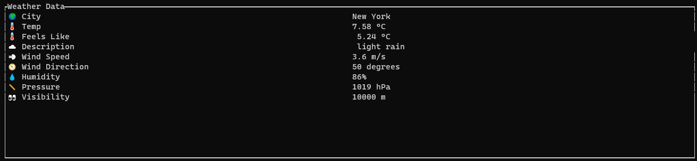

# Simple Weather TUI app in Rust

## Status
In development

## Description

This is a simple weather app written in Rust. It uses the [OpenWeatherMap](https://openweathermap.org/) API to get the weather data.



## Setup

1. Clone the repo

2. Create a .env file with the API key (temporary development placeholder to be replaced): OPENWEATHERMAP_API_KEY=your_api_key

3. Build the project with:

```bash
cargo build
```

## Usage

```bash
cargo run <CITY>
```

For example:

```bash
cargo run new york
```

## Future plans

- [ ] Create an actual TUI (for now this is just a simple CLI prototype)
- [ ] Add more weather data (e.g. weekly forecast)
- [ ] Add more options (e.g. temperature units)
- [ ] Make it fabulous

## License
MIT

## Contributing
Pull requests are welcome. For major changes, please open an issue first to discuss what you would like to change.


